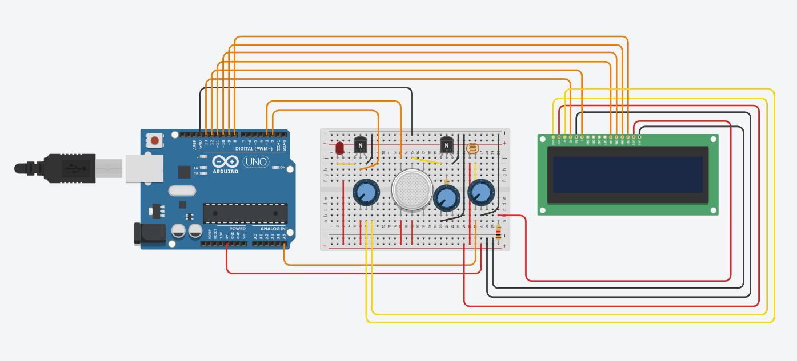
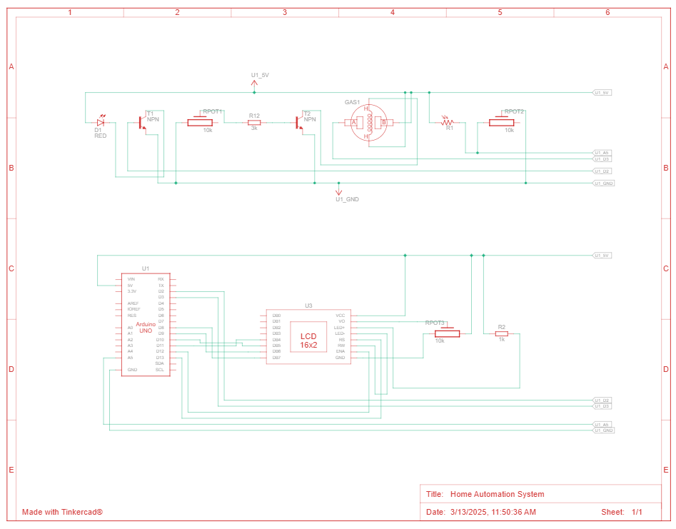

# Home Automation System

## Overview

This project is a home automation system designed to control various devices such as lights, buzzers, and sensors.
It uses an Arduino microcontroller to interface with these devices.

## Features

* **Smoke Detection**: Detects smoke and triggers an alarm with a buzzer and LED.
* **Light Control**: Automatically adjusts light brightness based on ambient light levels.
* **Time-Based Light Control**: Turns lights on and off based on the time of day.
* **Status Display**: Displays system status and messages on an LCD screen.
* **WiFi Connectivity**: Connects to a WiFi network for time synchronization using an NTP server.

## Getting Started

### **Prerequisites:**

* Visual Studio Code or equivalent IDE
* PlatformIO extension
* Required libraries:
  * LiquidCrystal
  * NTPClient

### Installation

#### From Release

1. Download the latest firmware release from the [Releases](https://github.com/chasacademy-team8/homeautomation/releases/) page.
2. Connect your Arduino to your computer.
3. Use the Arduino IDE or PlatformIO to upload the firmware to your Arduino.

#### From Source

1. Clone the repository:

    ```sh
    git clone https://github.com/orgs/chasacademy-team8/homeautomation.git
    ```

2. Open the project in Visual Studio Code.
3. Ensure you have the PlatformIO extension installed.
4. Open the PlatformIO Home tab in Visual Studio Code.
5. Connect your Arduino to your computer.
6. Build and upload the firmware using the PlatformIO extension:
    1. Click on the PlatformIO icon in the sidebar.
    2. Select "Build" to compile the project.
    3. Select "Upload" to upload the firmware to your Arduino.

## Latest Release

You can download the latest release from the [Releases](https://github.com/chasacademy-team8/homeautomation/releases/) page.

## Documentation

* [Project Idea](docs/idea.md)
* [SRS](docs/SRS.md)
* [Roadmap](https://github.com/orgs/chasacademy-team8/projects/3/views/7?sortedBy%5Bdirection%5D=asc&sortedBy%5BcolumnId%5D=174871397)
* [Milestones](https://github.com/chasacademy-team8/homeautomation/milestones)
* [Circuit](https://www.tinkercad.com/things/2BIRUlRgJSR-home-automation-system?sharecode=CB0rbs8jnQo0wepwYxnte0_Uei58wCmuA0ZicQ_sXoc)




Code Description

Below is a breakdown of the various header files and the functions they contain. Each header is designed to modularize specific components of the system for ease of development and maintenance.

Buzzer.h

This header contains functions related to the buzzer used in the home automation system, primarily for triggering sound alerts (e.g., smoke detection alarm).
Functions:

    initBuzzer():
        Initializes the buzzer pin (BUZZER_PIN) as an output, allowing it to be triggered by the system to produce sound alerts.

    soundBuzzer():
        Activates the buzzer for 500 milliseconds by setting the BUZZER_PIN high, then turns it off by setting the pin low. This is typically used for alerting events, such as smoke detectio

Config.h

This configuration header file centralizes the setup parameters for the Arduino board, including pin assignments, system thresholds, and other configuration settings. This makes it easier to modify and manage the system's hardware setup and parameters.
Key Sections:

    Pin Assignments:
        Predefines the variables for the pins used by various components, such as LEDs, sensors, and actuators.
        Example: LED_PIN_1 is assigned to pin 3, BUZZER_PIN to pin 5, and PHOTORESISTOR_PIN to analog pin A0.

    Display Configuration:
        Defines the pin assignments for controlling the LCD display. For instance, LCD_RS, LCD_EN, and the data pins (LCD_D4, LCD_D5, LCD_D6, LCD_D7).

    LED Configuration:
        Specifies the operating hours for the lights: TURN_ON_HOUR and TURN_OFF_HOUR.
        Also defines the light brightness levels for different ambient conditions: LIGHT_OFF, LIGHT_LOW, LIGHT_MEDIUM, and LIGHT_HIGH.

    Smoke Sensor Configuration:
        SMOKE_THRESHOLD is set to define the sensor's threshold for smoke detection, triggering alerts when exceeded.

    WiFi Settings:
        WIFI_ATTEMPTS determines the number of attempts to establish a WiFi connection before giving up.


Display.h

This header file manages all interactions with the display unit (LCD or other screens) to show important system information and messages.
Functions:

    initDisplay():
        Initializes the LCD display with a 16x2 layout (16 columns and 2 rows) and clears the screen to prepare it for further use.

    showHomeScreen(const String &currentTime):
        Displays the home screen, which includes the system title "Home Automation" on the first line and the current time on the second line. This function is typically used to display the system's main screen with real-time information.

    showStatusMessage(const String& message):
        Displays a status message on the second line of the screen, with the first line showing the "Status:" label. This function is used for displaying short messages about the system's current state (e.g., "System is armed" or "Smoke detected").

    showCustomMessage(const String& message, uint8_t col, uint8_t row, bool clear):
        Displays a custom message at the specified position on the screen (determined by col and row).
        If the clear argument is set to true, it clears the screen before showing the message. This function is flexible, allowing messages to be displayed anywhere on the screen and customized as needed.

Led.h

This header manages the LED(s) used in the system for visual indicators or feedback.
Functions:

    initLED():
        Initializes the LED pins (LED_PIN_1 and LED_PIN_2) as outputs, making them ready for control. Currently, only LED_PIN_1 is actively controlled.
    controlLED(uint8_t brightness):
        Controls the brightness of LED_PIN_1 based on the brightness value (ranging from 0 to 255), allowing for dimming of the LED. It uses analogWrite() to set the brightness level.
Matrix.h

This header file manages the initialization and control of the LED matrix used to display system statuses or visual effects, such as alerts and animations.
Functions:

    initMatrix():
        Initializes the LED matrix by setting it up with the appropriate pins and communication protocols.
        Loads a predefined animation sequence (LEDMATRIX_ANIMATION_HEARTBEAT_LINE) and begins playing it. This could be used to display visual alerts or a status indicator in the form of an animation.

Smoke_Sensor.h

This header file provides functions for managing the smoke detection sensor, allowing the system to detect smoke and trigger alarms or other actions in response.
Functions:

    initSmokeSensor():
        Initializes the smoke sensor by configuring the appropriate pins as input. This setup ensures the sensor can detect smoke via either a digital or analog signal, depending on the configuration.

    isSmokeDetected():
        Returns a boolean indicating whether smoke is detected, based on the sensor's reading. It checks the state of the digital pin (e.g., SMOKE_SENSOR_PIN_D) and returns true if smoke is present (when the pin state is HIGH).

    smokeInterrupt():
        This function is called when an interrupt is triggered by the smoke detection sensor. It currently prints a message to the serial monitor, but could be extended to handle other actions, such as activating an alarm (e.g., buzzer, LED).

WiFi_Handler.h

This header file contains functions for managing WiFi connectivity in the home automation system. It ensures the system can connect to a WiFi network and provides feedback on the connection status.
Functions:

    setupWifi(const char* ssid, const char* password):
        Attempts to connect to a WiFi network using the provided SSID and password.
        The function retries the connection up to a defined number of attempts (WIFI_ATTEMPTS), providing feedback on the connection status through the serial monitor and display screen (showStatusMessage).
        Once connected, it updates the system with a success message; otherwise, it notifies the user of a failure.

WiFi_Settings.h

This header file contains the necessary configuration settings for connecting the system to a WiFi network and an MQTT broker. It centralizes all the network-related credentials and settings, making it easy to modify network configurations as needed.
Configuration Settings:

    WiFi Network:
        WIFI_SSID: The SSID (network name) of the WiFi network to which the system should connect.
        WIFI_PASSWORD: The password for the WiFi network.

    NTP Server:
        NTP_SERVER: The address of the NTP server used for time synchronization (e.g., pool.ntp.org).

    MQTT Broker:
        MQTT_SERVER: The IP address of the MQTT broker.
        MQTT_PORT: The port number for the MQTT broker (default is 1883).
        MQTT_USER: The username for MQTT authentication.
        MQTT_PASSWORD: The password for MQTT authentication.

    WiFi Enable Flag:
        WIFI_ENABLED: A flag to enable or disable WiFi functionality. It is currently set but not used explicitly in this file.


### future enchantments
* Adding a sensor that detects motion

## License

This project is licensed under the MIT License.
