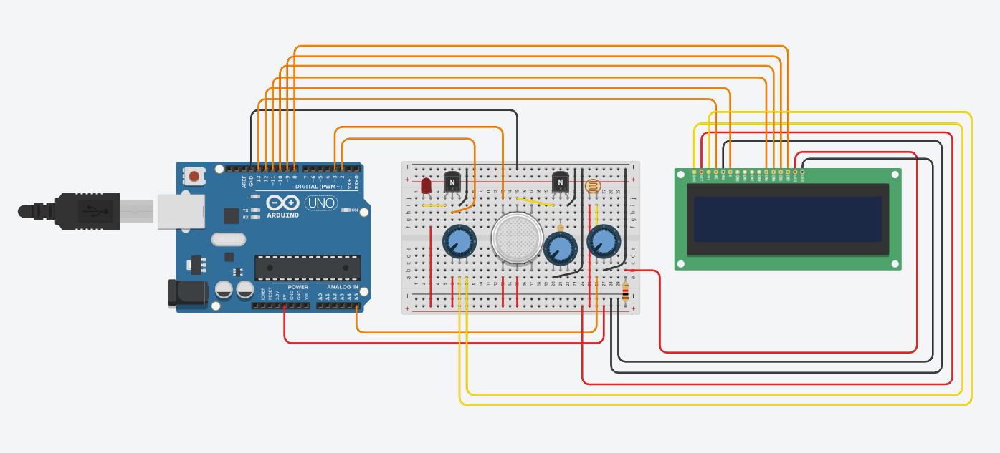
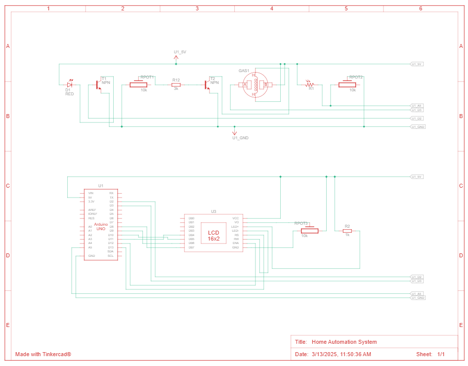

# Home Automation System

## Overview

## Features

## Getting Started

## Documentation
- [Project Idea](docs/idea.md)
- [SRS](docs/SRS.md)
- [Roadmap](https://github.com/orgs/chasacademy-team8/projects/3/views/7?sortedBy%5Bdirection%5D=asc&sortedBy%5BcolumnId%5D=174871397)
- [Circuit](https://www.tinkercad.com/things/2BIRUlRgJSR-home-automation-system?sharecode=CB0rbs8jnQo0wepwYxnte0_Uei58wCmuA0ZicQ_sXoc)

## License
This project is licensed under the MIT License.
